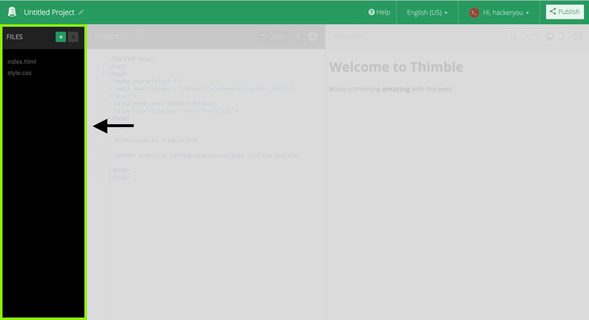
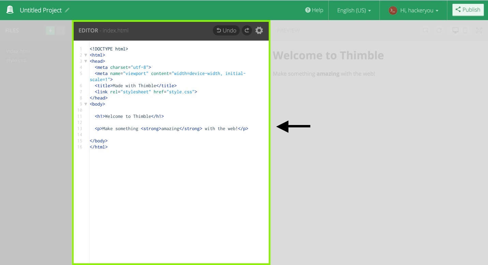
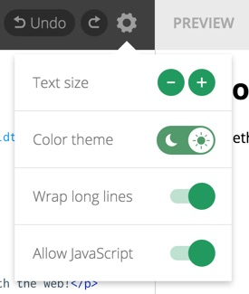
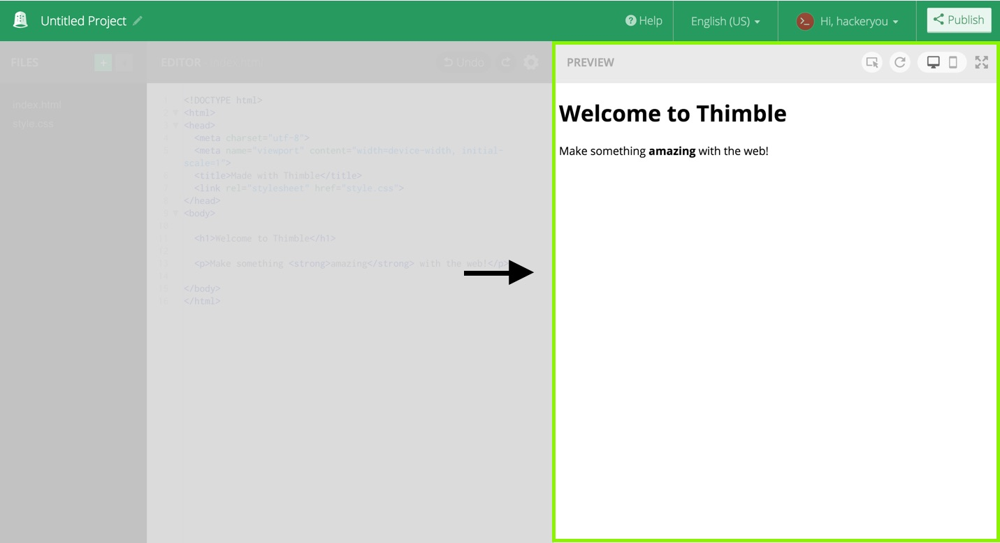
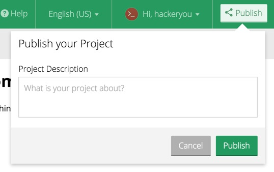

# Thimble

[Mozilla Thimble](https://thimble.mozilla.org/en-US/) is a free, online tool that allows HTML and CSS to be written directly in the browser and instantly see the result. Thimble also offers the ability to create pre-written projects that can be modified ('remixed') by learners and then published and shared online.

Learners do not require an account to start coding but if you want to save projects, you will need to signup.

All HTML pages require some default, starter code in order to render properly.

```HTML
<!DOCTYPE html>
<html>
<head>
  <meta charset="utf-8">
  <meta name="viewport" content="width=device-width, initial-scale=1">
  <title>Made with Thimble</title>
</head>
<body>

  <h1>Welcome to Thimble</h1>

  <p>Make something <strong>amazing</strong> with the web!</p>

</body>
</html>
```

This code will appear by default in any newly created HTML pages within Thimble. It helps tell the browser some information about the page and how to render it.

## Thimble Interface

Thimble comes with a very user friendly interface that allows you to code, and immediately see the result.

When you create a new project in Thimble, the site is broken up into three parts. Your project files, the Editor and the Preview.

### File Panel



The files area of the site shows you what files are included in your project. By default Thimble will include an `index.html` and `style.css` file. To create a new file, or upload a file to use in your project, click the green '+' button!

### Editor Panel

The editor panel is where we write our HTML and CSS for our project.



When we type into this area, it will do it's best to help us finish our code and even give us hints!.

To change the size of the text, or to make the editor use a darker theme, click the settings cog for a menu!



### Preview Panel

The preview panel displays our webpage as we are making changes to it. Any code we write in the editor panel (that works!) will display in the preview panel.



## Publishing

Thimble allows users to publish and share their creations with friends and family. By click on the 'Publish' button in the top right corner.


